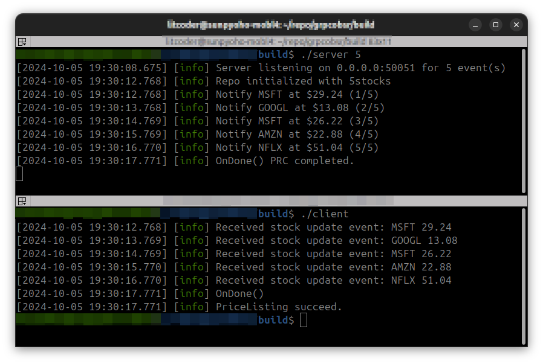

# Event subscription on gRPC (C++)
Event subscription example on gRPC. This code implement a simple POC program that sends/receives randomly choosen stock data with random price changes.

## Build
```
mkdir -p build && cd $_
cmake ..
make -j $(nproc)
```

## Run
From a terminal application, run `./server` and `./client` respectively. Note that server accepts number of events to be sent to client, 0 will be set if not given which indicates infinite events.


